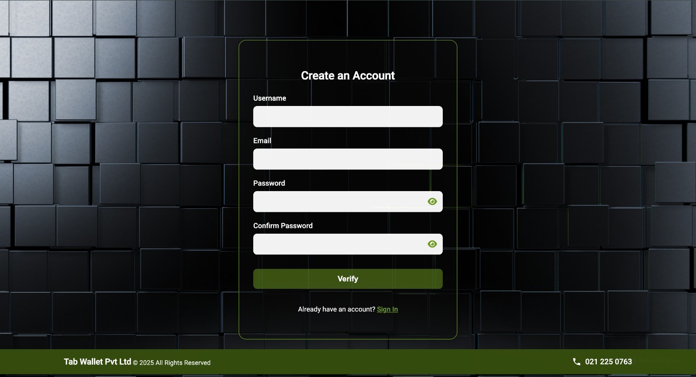
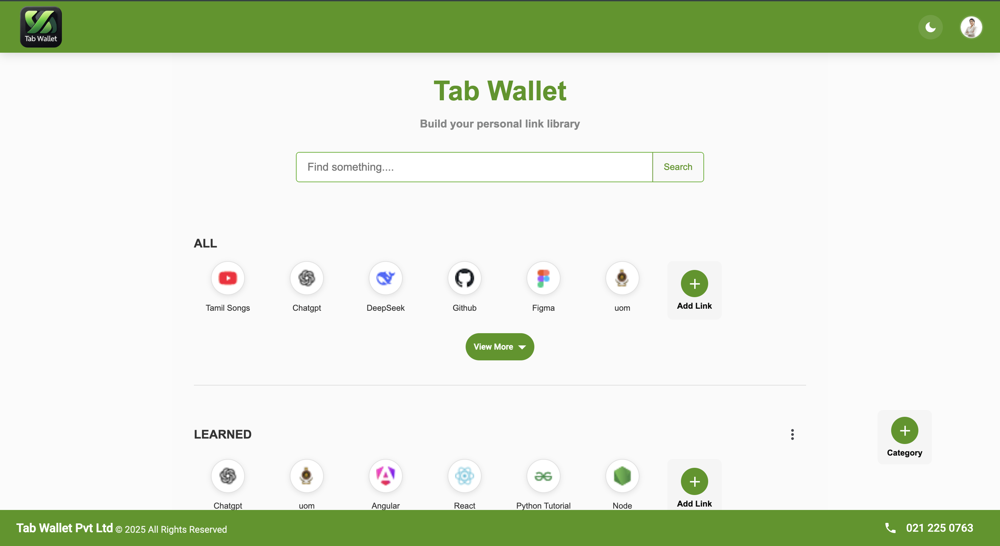
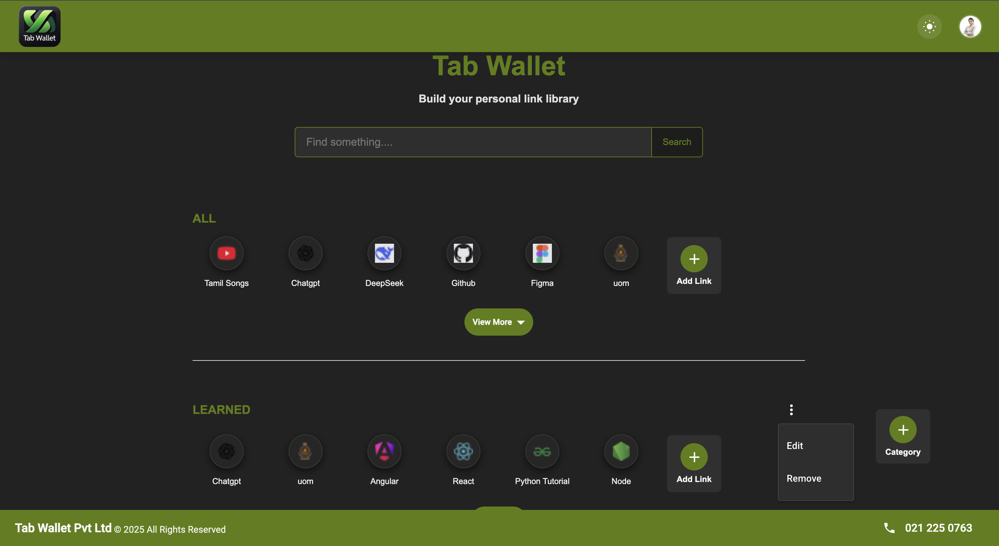
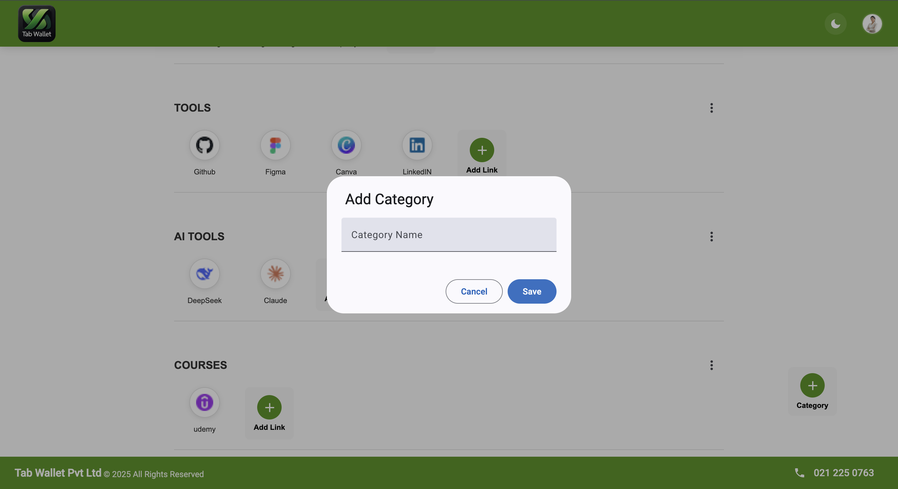
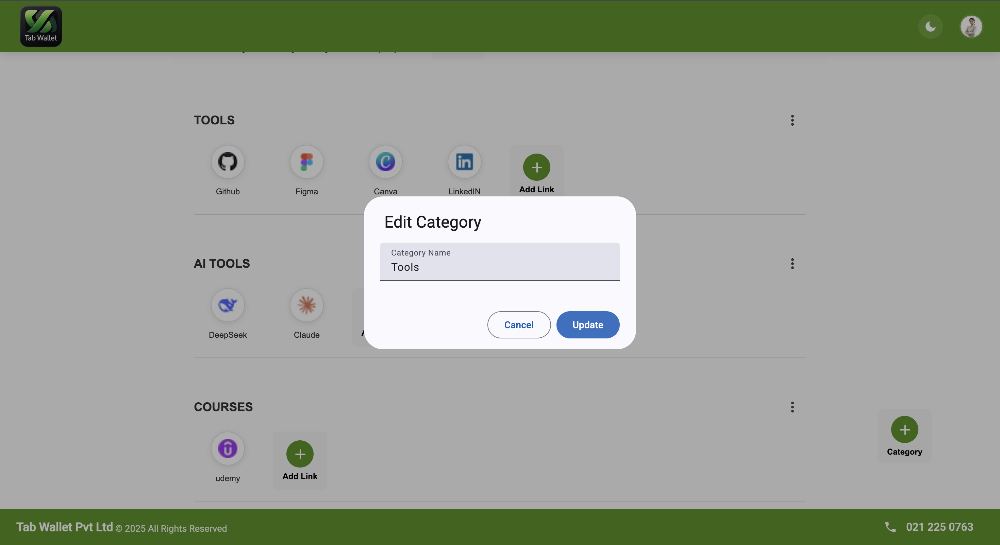
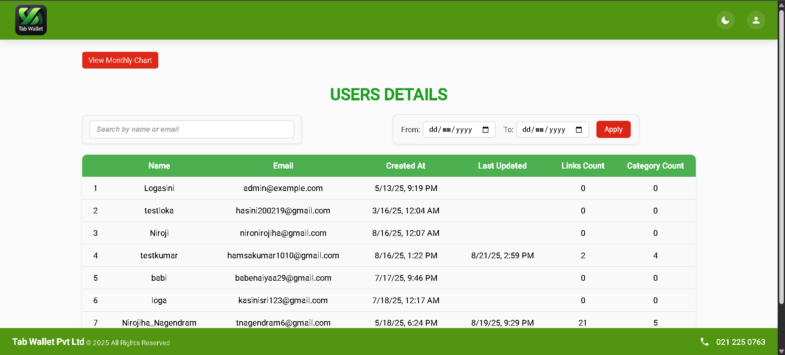
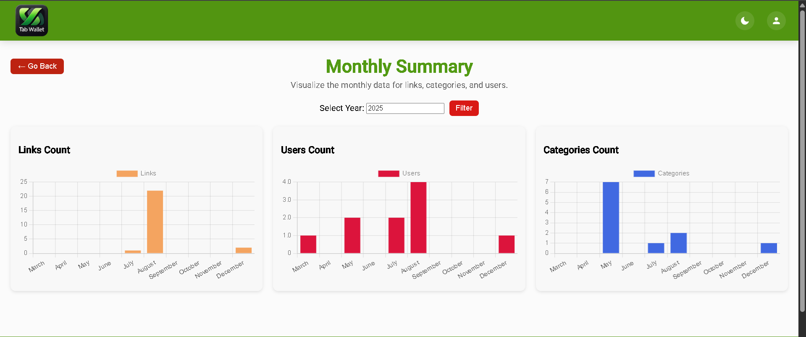

<div align="center">

# 🏅 WSO2 Ballerina Competition 2025 — Official Entry


# TabWallet
### Secure Link Intelligence & Organization Platform

[](https://angular.io/)
[](https://ballerina.io/)
[](https://www.mongodb.com/)
[](https://jwt.io/)
[](https://www.typescriptlang.org/)

> **Official competition entry for WSO2 Ballerina Competition 2025** — a nationally recognized developer challenge organized by WSO2, one of the world's leading open-source integration software companies.  
> TabWallet is a secure, encrypted link-management platform with role-based access control, dark mode, and real-time admin tooling — built with cutting-edge cloud-native technologies.

</div>

---

## 📋 Table of Contents

- [Competition Context](#-competition-context)
- [Project Overview](#-project-overview)
- [UI & Screenshots](#-ui--screenshots)
- [Key Features](#-key-features)
- [Security Implementation](#-security-implementation)
- [System Architecture](#-system-architecture)
- [Tech Stack](#-tech-stack)
- [Project Structure](#-project-structure)
- [Getting Started](#-getting-started)
- [API Reference](#-api-reference)
- [What I Learned](#-what-i-learned)

---

## 🏅 Competition Context

| Event | Organizer | Year |
|---|---|---|
| **WSO2 Ballerina Competition 2025** | WSO2 Inc. (Global Open-Source Integration Leader) | 2025 |

TabWallet was built as an official entry for the **WSO2 Ballerina Competition 2025** — a developer challenge that tests the ability to build secure, production-grade cloud-native applications using Ballerina, WSO2's modern programming language purpose-built for network-distributed services.

> **What made this technically challenging:** Ballerina is not a mainstream language. Picking it up, designing a secure multi-role API system, and shipping a full-stack application with Angular within the competition window demonstrates the ability to rapidly learn and apply unfamiliar, industry-relevant technologies.

---

## 🔍 Project Overview

**TabWallet** is a full-stack link-management platform that enables users to securely store, organize, and manage personal or professional links in categorized collections — with encrypted storage, JWT-protected APIs, and a role-aware admin dashboard.

### User Roles at a Glance

| Role | Capabilities |
|---|---|
| **User** | Register, verify email, manage links & categories, update profile |
| **Admin** | Full platform visibility — manage all users, links, categories, and system health |

**Core Problem Solved:** Bookmarks are scattered across browsers, devices, and platforms. TabWallet centralizes link management with security-first architecture — links are encrypted at rest, access is token-gated, and every operation is role-validated.

---

## 📱 UI & Screenshots

> Built with Angular + custom SCSS theming — includes full dark mode support.

### Login


### Sign Up


### Home Dashboard


### Dark Mode


### Add Category


### Edit Category


### Admin Dashboard



---

## ✨ Key Features

### 🔐 Authentication & Identity
- Secure registration with **SMTP Gmail email verification** — inactive accounts cannot access the system
- **JWT-based authentication** — stateless, scalable, and industry-standard
- **Role-Based Access Control (RBAC)** — User and Admin roles enforced at the API level, not just the UI

### 🔗 Encrypted Link Management
- Add, edit, and delete personal or professional links
- **Organize links into categories** for structured, searchable collections
- All link and category data is **encrypted at rest** — even database-level access doesn't expose raw user data
- Full CRUD operations with sanitized inputs and safe database query patterns

### 👤 Profile Management
- Update username and password securely at any time
- Password changes re-validated against security policies

### 🌙 UI/UX — Dark Mode & Theming
- Full **dark mode support** with custom Angular Material SCSS theme
- Responsive, mobile-aware layout
- Monthly bar chart analytics for link activity visualization

### 🛡️ Admin Dashboard
- Complete visibility into all users, links, and categories across the platform
- Admin-level CRUD — create, edit, delete any resource
- User monitoring and management tooling

---

## 🔒 Security Implementation

Security is the cornerstone of TabWallet. Every layer of the stack has deliberate security controls.

### Password Hashing
User passwords are never stored in plaintext. Before persisting to MongoDB, passwords are run through a **cryptographic hashing algorithm** — meaning even a full database leak exposes no usable credentials.

```
Registration:  plainPassword → hash(password + salt) → store hash only
Login:         inputPassword → hash(input + storedSalt) → compare with stored hash
               Match → JWT issued | No Match → 401 Unauthorized
```

### Link & Category Encryption
Unlike most link managers that store URLs as plaintext, TabWallet **encrypts link and category data at rest**. This ensures user data remains private even at the infrastructure level.

```
User adds link → Encrypt(linkData, serverKey) → Store ciphertext in MongoDB
User fetches links → Fetch ciphertext → Decrypt(ciphertext, serverKey) → Return to client
```

### JWT Authentication & Token Lifecycle
All protected routes require a valid, unexpired JWT signed with the server's secret key.

```
POST /auth/login (success)
  → Server issues JWT: { userId, role, iat, exp }
  → Signed with HMAC-SHA256 (server secret never leaves backend)

Subsequent requests:
  Authorization: Bearer <token>
  → Ballerina middleware validates signature
  → Checks exp (expiration) — rejects stale tokens
  → Checks role claim — enforces RBAC per endpoint
```

**Token Expiration** ensures compromised tokens have a limited validity window — short-lived tokens reduce attack surface.

### Role-Based Access Control (RBAC)
Ballerina's resource functions are decorated with role checks. Admin endpoints are inaccessible to User-role tokens — enforced server-side, not just hidden in the UI.

```ballerina
// Only Admin role tokens can access this resource
resource function get admin/users(http:Caller caller, http:Request req) returns error? {
    // Role extracted from JWT claims, validated before execution
}
```

### Input Sanitization
All user inputs are validated and sanitized before reaching the database layer — protecting against injection attacks and malformed data corrupting the system.

---

## 🏗️ System Architecture

```
┌───────────────────────────────────────────────────────────┐
│                     CLIENT LAYER                           │
│              Angular 17 SPA (TypeScript)                   │
│   Components → Services (HTTP) → Route Guards (JWT check)  │
└──────────────────────┬────────────────────────────────────┘
                       │ HTTPS / REST
┌──────────────────────▼────────────────────────────────────┐
│                    BACKEND LAYER                           │
│           Ballerina Cloud-Native API Server                │
│  Auth.bal | Admin.bal | Home.bal → JWT Middleware → RBAC   │
└──────────────────────┬────────────────────────────────────┘
                       │ Encrypted Read/Write
┌──────────────────────▼────────────────────────────────────┐
│                   DATA LAYER                               │
│                   MongoDB                                  │
│     Users (hashed) | Links (encrypted) | Categories        │
└───────────────────────────────────────────────────────────┘
```

**Key architectural decisions:**

- **Ballerina for the backend** — Purpose-built for networked services; native HTTP, JSON, and security primitives reduce boilerplate and attack surface
- **Angular with Route Guards** — JWT validation happens at the client routing layer, preventing unauthorized UI access before any API call is made
- **Modular Ballerina files** — `Auth.bal`, `Admin.bal`, `Home.bal` separate concerns cleanly; each module owns its routes and authorization logic
- **MongoDB document model** — Flexible schema accommodates variable link/category structures per user without rigid relational constraints

---

## 🛠️ Tech Stack

| Layer | Technology | Purpose |
|---|---|---|
| Frontend Framework | Angular 17 | SPA with component-based UI architecture |
| Frontend Language | TypeScript | Type-safe client-side code |
| Styling | SCSS + Angular Material | Custom theming, dark mode, responsive layout |
| Backend Language | Ballerina | Cloud-native, network-centric API server |
| API Style | RESTful HTTP | Stateless resource-oriented endpoints |
| Database | MongoDB | Encrypted document storage |
| Authentication | JWT (HMAC-SHA256) | Stateless token-based auth |
| Email Verification | SMTP (Gmail) | Account activation flow |
| Dev Tools | VS Code, Postman, Git/GitHub | Development, API testing, version control |

---

## 📁 Project Structure

```
TabWallet/
├── README.md
├── angular.json                          # Angular workspace config
├── package.json
├── tsconfig.json
│
├── frontend/                             # Angular SPA
│   └── src/
│       ├── app/
│       │   ├── guard/                    # Route guards (JWT auth checks)
│       │   ├── service/                  # HTTP service layer (API calls)
│       │   ├── model/                    # TypeScript interfaces/models
│       │   ├── home/                     # Main dashboard view
│       │   ├── landingpage/              # Public landing page
│       │   ├── panel/                    # Link/category management panel
│       │   ├── profile/                  # User profile management
│       │   ├── user-list/                # Admin user management view
│       │   ├── filter-bar/               # Search & filter UI
│       │   ├── search-bar/               # Search component
│       │   ├── monthly-bar-chart/        # Analytics chart component
│       │   └── shared/                   # Shared components & utilities
│       ├── environments/                 # Environment config (dev/prod)
│       ├── custom-theme.scss             # Angular Material dark/light theme
│       └── styles.css
│
└── backend/                              # Ballerina API Server
    ├── main.bal                          # Entry point & server bootstrap
    ├── Auth.bal                          # Authentication routes & JWT logic
    ├── Admin.bal                         # Admin-only endpoints (RBAC)
    ├── home.bal                          # User dashboard endpoints
    ├── db_config.bal                     # MongoDB connection configuration
    ├── Ballerina.toml                    # Project metadata
    ├── config.toml                       # Environment configuration
    └── Dependencies.toml                 # Dependency lock file
```

---

## 🚀 Getting Started

### Prerequisites

| Tool | Version |
|---|---|
| Ballerina | Swan Lake 2201.x+ |
| Node.js | 18+ |
| Angular CLI | 17+ |
| MongoDB | 6.0+ (local or Atlas) |

### 1. Clone the Repository

```bash
git clone https://github.com/your-username/TabWallet.git
cd TabWallet
```

### 2. Configure the Backend

Edit `backend/config.toml`:

```toml
[database]
connectionString = "mongodb://localhost:27017"
databaseName = "TabWallet"

[jwt]
secret = "your-secret-key-minimum-32-characters"
expiryInSeconds = 86400

[smtp]
host = "smtp.gmail.com"
port = 587
username = "your-email@gmail.com"
password = "your-app-password"
```

### 3. Run the Backend (Ballerina)

```bash
cd backend
bal run
```

> ✅ Backend API starts on: `http://localhost:9090`  
> Ensure MongoDB is running and reachable before starting.

### 4. Run the Frontend (Angular)

```bash
cd frontend
npm install
ng serve
```

> 🌐 Application available at: `http://localhost:4200`

---

## 📡 API Reference

| Method | Endpoint | Role | Description |
|---|---|---|---|
| `POST` | `/auth/register` | Public | Create new account |
| `POST` | `/auth/login` | Public | Login, receive JWT |
| `POST` | `/auth/verify` | Public | Email verification |
| `GET` | `/home/links` | User | Get user's links |
| `POST` | `/home/links` | User | Add new link |
| `PUT` | `/home/links/{id}` | User | Update link |
| `DELETE` | `/home/links/{id}` | User | Delete link |
| `GET` | `/home/categories` | User | Get user's categories |
| `POST` | `/home/categories` | User | Create category |
| `PUT` | `/profile/username` | User | Update username |
| `PUT` | `/profile/password` | User | Change password |
| `GET` | `/admin/users` | Admin | List all users |
| `GET` | `/admin/links` | Admin | View all links |
| `DELETE` | `/admin/users/{id}` | Admin | Remove a user |

All protected endpoints require: `Authorization: Bearer <JWT_TOKEN>`

---

## 💡 What I Learned

Building TabWallet stretched my technical boundaries in deliberate ways:

- **Ballerina as a new paradigm** — Learning a purpose-built network language from scratch under competition pressure taught me that strong fundamentals (HTTP, REST, security) transfer across languages faster than expected
- **Encryption beyond authentication** — Most tutorials stop at hashing passwords. Implementing field-level encryption for link data required understanding encryption primitives, key management, and the performance trade-offs of encrypting at the application layer
- **Angular Route Guards in production patterns** — Building auth guards that intercept routing decisions (not just hide buttons) showed the difference between security theatre and actual access control
- **Separation of concerns in Ballerina** — Modularizing into `Auth.bal`, `Admin.bal`, `Home.bal` mirrors the microservice mindset — each file is a bounded context that owns its routes, logic, and authorization policy
- **Full-stack thinking** — Designing a system where the database, API, and UI all independently enforce the same security rules (defense in depth) rather than trusting any single layer

---

## 👨‍💻 Built By

Developed for the **WSO2 Ballerina Competition 2025**  
A nationally recognized developer challenge by WSO2 — a global leader in open-source integration and API management.

> *"Built with a language most developers haven't used — because learning under pressure is how real engineers grow."*

---

<div align="center">

**If this project impressed you, feel free to ⭐ star the repo and connect!**

[](https://linkedin.com/in/your-profile)
[](https://github.com/your-username)

</div>